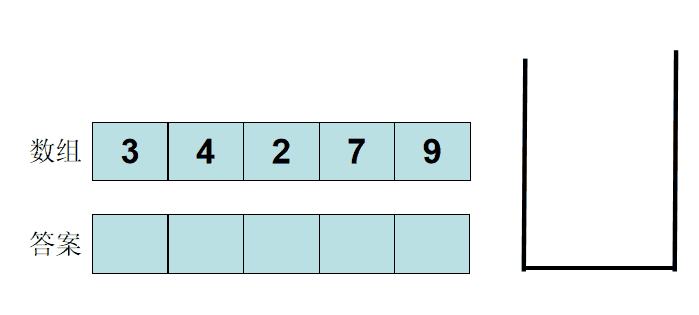

# 数据结构模拟

此篇是对数据结构模拟的代码总结，主要记录链表、栈、队列、单调栈、单调队列、并查集、哈希表的模拟。

#### 链表

**单链表**

单链表可以用 `forward_list`，但没必要，单链表能实现的东西双链表都可以，不需要对链表内部指针修改都可以用双链表。

```
#include<iostream>
#include<algorithm>
using namespace std;

const int N = 1e5 + 10;

int head, e[N], ne[N], idx;

void init(){
    head = -1;
    idx = 0;
}

void insert_head(int x){ // 插入到头
    e[idx] = x, ne[idx] = head, head = idx ++;
}

void insert(int k, int x){ // 插入到第 k 个插入的数
    e[idx] = x, ne[idx] = ne[k], ne[k] = idx ++;
}

void remove(int k){
    ne[k] = ne[ne[k]]; 
}

int main(){
    int n; cin >> n;
    
    init();
    while (n -- ){
        char a; cin >> a;
        if (a == 'H'){
            int x; cin >> x;
            insert_head(x);
        } else if (a == 'D'){
            int k; cin >> k;
            if (!k) head = ne[head];
            else remove(k - 1);
        } else {
            int k, x; cin >> k >> x;
            insert(k - 1, x); 
        }
    }
    
    for (int i = head; i != -1; i = ne[i]){
        cout << e[i] << ' ';
    }
    cout << endl;
}
```

**双链表**

双链表可以用 `list` 来实现。

#### 栈

栈可以的用 `vector` 来实现。

#### 单调栈

单调栈的意思是栈内元素递增或递减。 此图来源[acwing的兄弟](https://www.acwing.com/solution/content/27437/)



#### 队列

队列可以用 `queue` 来实现。

#### 单调队列
