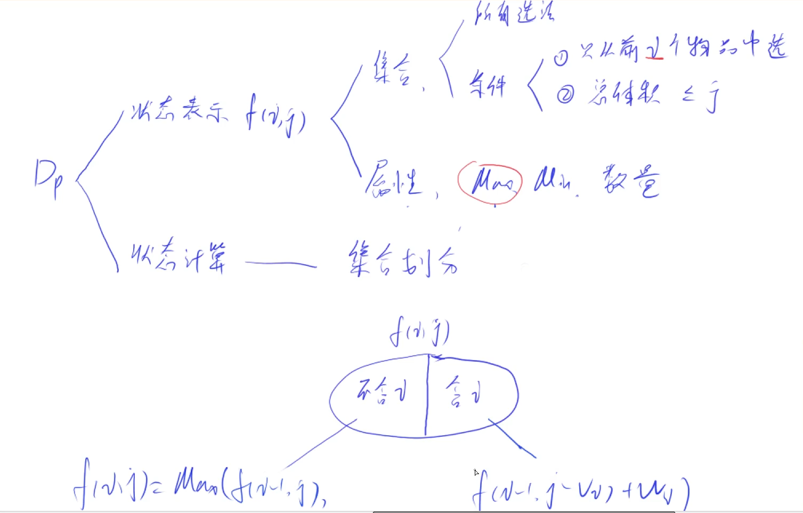

# 背包

背包问题的大致描述如下：

> 有  $$n$$ 个物品和一个容量为 $$v$$ 的背包，每个物品有体积 $$v_i$$ 和价值 $$w_i$$ 两种属性，要求选若干物品放入背包使背包中物品的总价值最大且背包中物品的总重量不超过背包的容量。

背包问题也被分成了很多类，例如：0-1 背包、完全背包、多重背包、分组背包。求解还被分为求最大值，最小值，恰好值，方案数，具体方案。

## 0-1背包

0-1 背包问题的特点是**每个物品只能使用一次**。



dp 问题的本质其实也是暴力，只不过利用了前者的经验，省去了一部分力气。 一般考虑 dp 问题首先确定我们问题的状态表示，也就是多维数组的维数和意义。而 0-1 背包是 $$f(i, j)$$ 表示在前 $$i$$ 个选取物品且体积不超过 $$j$$ 的情况下最大价值。然后再考虑，如何计算 $$f(i, j)$$。这里考虑问题一定要向递归的方向思考，利用前者的结果来想，否则是无法直接计算 $$f(i, j)$$ 的。**而递归都是怎么想的**？比较熟悉的组合数的递归公式是

$$
{n \choose k} = {n-1 \choose k-1} + {n-1 \choose k}
$$

看到这就应该懂了，考虑递归的话要利用之前的经验。那么 $$f(i,j)$$ 由于体积的限制，当我要取第 $$i$$ 的时候，可以分为由于装不下第 $$i$$ 个物品而不取第 $$i$$ 个和满足体积要求取第 $$i$$ 个。不取第 $$i$$ 个的值为 $$f(i-1,j)$$，取第 $$i$$ 个的话那么体积要减少价值会增加，其值为 $$f(i-1,j-v)+w$$。

$$
f(i,j) = max(f(i-1,j),\ f(i-1,j-v_i) + w_i)
$$


> 有 $$N$$ 件物品和一个容量是 $$V$$ 的背包。每件物品只能使用一次。
第 $$i$$ 件物品的体积是 $$v_i$$，价值是 $$w_i$$。
求解将哪些物品装入背包，可使这些物品的总体积不超过背包容量，且总价值最大。输出最大价值。
**输入格式**
第一行两个整数 $$N$$，$$V$$，用空格隔开，分别表示物品数量和背包容积。
接下来有 $$N$$ 行，每行两个整数 $$v_i$$，$$w_i$$，用空格隔开，分别表示第 $$i$$ 件物品的体积和价值。
**输出格式**
输出一个整数，表示最大价值。
**数据范围**
$$
0<N,V≤1000\\
0<vi,wi≤1000
$$

**朴素二维空间代码：**

```cpp
#include<iostream>
#include<algorithm>
using namespace std;
const int N = 1010;
int v[N],w[N];
int dp[N][N];

int main(){
    int n, m; cin >> n >> m;
    for (int i = 1; i <= n; i ++) cin >> v[i] >> w[i];
    
    for (int i = 1; i <= n; i ++)
        for (int j = 1; j <= m; j ++){
            dp[i][j] = dp[i - 1][j];
            if (j >= v[i]) dp[i][j] = max(dp[i][j], dp[i - 1][j - v[i]] + w[i]);
        }
    cout << dp[n][m];
}
```

其实还可以进行降维优化，由于更新第 $$i$$ 层时只用了第 $$i-1$$ 并且更新每个 $$j$$ 时用到的数据都是之前的数据，可以利用滚动数组来优化。

**一维空间代码：**

此时的状态数组的含义变为了在 i 体积下，物品的最大值为多少。

```cpp
// input
// 4 5
// 1 2
// 2 4
// 3 4
// 4 5
// output
// state update
// 0 2 2 2 2 2 
// 0 2 4 6 6 6 
// 0 2 4 6 6 8 
// 0 2 4 6 6 8 
// 8
#include<iostream>
#include<algorithm>
using namespace std;
const int N = 1010;
int v[N],w[N];
int dp[N]; //

int main(){
    int n, m; cin >> n >> m;
    for (int i = 1; i <= n; i ++) cin >> v[i] >> w[i];
    
    for (int i = 1; i <= n; i ++)
        for (int j = m; j >= v[i]; j --)
            dp[j] = max(dp[j], dp[j - v[i]] + w[i]);
            
    cout << dp[m];
}
```


**完全背包**

完全背包的特点是**每个物品无限次使用**。 相同与 0-1 背包问题的分析方法。

* 状态表示 $$f(i,j)$$ 表示选取前 $$i$$ 个物品中体积不超过 $$j$$ 的最大价值。
* 状态计算 当不选第 $$i$$ 件物品时，$$f(i,j) = f(i-1,j)$$。 当选第 $$i$$ 件物品时，可以任意的选取第 $$i$$ 件物品，既 $$f(i,j)=f(i-1,j-k*v)+k*w$$。

$$
f(i,j) = max(f(i-1,j), f(i-1, j-k*v_i) + k*w_i)
$$

不过真用这个式子来计算的话会超时。考虑

$$
\begin{cases} f(i,j) &= max(f(i-1,j),&f(i-1,j-v)+w,&f(i-1,j-2v)+2w,\cdots) \\ f(i,j-v) &= max(&f(i-1,j-v),&f(i-1,j-2*v)+w,\cdots) \end{cases}
$$

可得

$$
f(i, j) = max(f(i-1,j), f(i, j-v_i) + w_i)
$$

```cpp
#include<iostream>
#include<algorithm>
using namespace std;

const int N = 1010;

int v[N], w[N];
int dp[N][N];

int main(){
    int n, m; cin >> n >> m;
    for (int i = 1; i <= n; i ++) scanf("%d %d", &v[i], &w[i]);
    
    for (int i = 1; i <= n; i ++)
        for (int j = 1; j <= m; j ++){
            dp[i][j] = dp[i - 1][j];
            if (j >= v[i]) dp[i][j] = max(dp[i][j], dp[i][j - v[i]] + w[i]);
        }
    cout << dp[n][m];
}
```

和 0-1 背包问题很相似，也可以优化为一维。

```cpp
#include<iostream>
#include<algorithm>
using namespace std;

const int N = 1010;

int v[N], w[N];
int dp[N];

int main(){
    int n, m; cin >> n >> m;
    for (int i = 1; i <= n; i ++) scanf("%d %d", &v[i], &w[i]);
    
    for (int i = 1; i <= n; i ++)
        for (int j = v[i]; j <= m; j ++)
            dp[j] = max(dp[j], dp[j - v[i]] + w[i]);

    cout << dp[m];
}
```

**多重背包**

多重背包的特点是**背包数量不定**。 _y氏dp分析法_

* 状态表示 $$f(i,j)$$ 表示前 $$i$$ 个物品体积不超过 $$j$$ 的最大价值。
* 状态计算 当不选第 $$i$$ 种物品，则 $$f(i,j) = f(i-1, j)$$ 当选第 $$i$$ 种物品，则 $$f(i,j) = f(i - 1, j - k*v)+k*w$$

$$
f(i,j) = max(f(i-1,j), f(i - 1, j - k * v_i) + k * w_i)
$$

```cpp
#include<iostream>
#include<algorithm>
using namespace std;

const int N = 1010;

int v[N], w[N], s[N];
int dp[N][N];

int main(){
    int n, m; cin >> n >> m;
    for (int i = 1; i <= n; i ++) scanf("%d %d %d", &v[i], &w[i], &s[i]);
    
    for (int i = 1; i <= n; i ++)
        for (int j = 0; j <= m; j ++)
            for (int k = 0; k <= s[i] && k * v[i] <= j; k ++){
                dp[i][j] = max(dp[i][j], dp[i - 1][j - k * v[i]] + k * w[i]);
            }
            
    cout << dp[n][m] << endl;
}
```

多重背包可以优化，可以使用滚动数组优化。

```cpp
#include<iostream>
using namespace std;

const int N = 110;

int f[N];

int main() {
    int n, m; cin >> n >> m;
    
    for (int i = 0; i < n; i ++) {
        int v, w, s; cin >> v >> w >> s;
        
        for (int j = m; j >= v; j --) {
            for (int k = 0; k <= s && k * v <= j; k ++) {
                f[j] = max(f[j], f[j - k * v] + k * w);
            }
        }
    }
    
    cout << f[m] << endl; 
}
```


也可以二进制优化，将多重背包优化为 0-1 背包。考虑单个种类的物品，假设此种类的物品的数量为 $$N$$，我们要选取此种类的物品的数量为 $$x$$。难道我们要像完全背包那样从 $$0 \sim N$$ 枚举来获得 $$x$$ 吗？**可以但没必要。** 我们可以将此类物品打包成数量为 $$1+2+4+\cdots+ c = N$$，举个例子：

$$
6 = 1 + 2 + 3 \\ 18 = 1 + 2 + 4 + 8 + 3
$$

通过这样打包，我们可以使用这些包装过的物品能够凑出选取 $$0 \sim N$$ 的所有数量的物品，而且使用每个包装的数量为 $$0$$ 或者 $$1$$，完美满足 0-1 背包的性质。这样就可以转化为 0-1 背包的问题。

```cpp
#include<iostream>
#include<algorithm>
using namespace std;

const int N = 15000;
int v[N], w[N];
int f[N];

int main(){
    int n, m; cin >> n >> m;
    int cnt = 0;
    for (int i = 1; i <= n; i ++){
        int a, b, s;
        cin >> a >> b >> s;
        int k = 1;
        while (k <= s){
            cnt ++;
            v[cnt] = a * k;
            w[cnt] = b * k;
            s -= k;
            k <<= 1;
        }
        if (s > 0) {
            cnt ++;
            v[cnt] = a * s;
            w[cnt] = b * s;
            
        }
    }
    n = cnt;
    for (int i = 1; i <= n; i ++)
        for (int j = m; j >= v[i]; j --)
            f[j] = max(f[j], f[j - v[i]] + w[i]);
            
    cout << f[m] << endl;
}
```

**分组背包**

分组背包的特点是**每个组有多个种类物品，但每个组只选取一个物品**

* 状态分析 $$f(i,j)$$ 表示前 $$i$$ **组**物品体积不超过 $$j$$ 的最大价值。
* 状态计算 不选取第 $$i$$ **组**物品，$$f(i,j) = f(i-1, j)$$ 选取第 $$i$$ **组**物品，$$f(i,j) = f(i-1,j - v[i,k]) + w[i,k]$$

$$
f(i,j) = max(f(i-1,j),f(i-1,j - v[i,k]) + w[i,k])
$$

```cpp
#include<iostream>
#include<algorithm>
using namespace std;

const int N = 110;

int v[N][N], w[N][N];
int s[N];
int f[N];

int main(){
    int n, m; cin >> n >> m;
    for (int i = 1; i <= n; i ++ ){
        int k; cin >> k;
        s[i] = k;
        for (int j = 1; j <= k; j ++ ){
            cin >> v[i][j] >> w[i][j];
        }
    }
    
    for (int i = 1; i <= n; i ++)
        for (int j = m; j >= 0; j --)
            for (int k = 1; k <= s[i]; k ++)
                if (j >= v[i][k])
                    f[j] = max(f[j], f[j - v[i][k]] + w[i][k]);
    
    cout << f[m] << endl;
                
}
```
