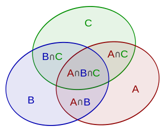

# 容斥原理

#### 容斥原理

容斥原理就是求几个集合的并集的元素个数的公式。换句话说就是整体韦恩图的元素个数。

$$
|\bigcup_{i=1}^n A_i| = {\sum_{i=1}^n |A_i|} - {\sum_{1 \le i \lt j \le n} |A_i \cap A_j|} + {\sum_{1 \le i \lt j \lt k \le n} |A_i \cap A_j \cap A_k|} - \cdots + (-1)^{n-1}|A_1 \cap \cdots \cap A_n|
$$

其中 $$|A|$$ 表示 $$A$$ 的基数。例如在两个集合的情况，我们可以通过将 $$|A|$$ 和 $$|B|$$ 相加，再减去其交际的基数，而得到其并集的基数。&#x20;



**三个集合的容斥原理**

$$
|A \cup B \cup C| = |A| + |B| + |C| - |A \cap B| - |A \cap C| - |B \cap C| + |A \cap B \cap C|
$$

注意公式中符号，奇数为加，偶数为减。还有总体数量为 $$3 \choose 1$$ + $$3 \choose 2$$ + $$3 \choose 3$$，我们知道组合数的全加与二项式的系数有关，公式为：

$$
(1 + x)^n = \sum_{k=0}^n{n \choose k}x^k = {n \choose 0} + {n \choose 1}x + \cdots + {n \choose n}x^n
$$

令 $$x = 1$$，则上式为:

$$
2^n = \sum_{k=0}^n{n \choose k} = {n \choose 0} + {n \choose 1} +\cdots + {n \choose n} \\ 2^n - 1 = {n \choose 1} + \cdots + {n \choose n}
$$

可以发现我们相求的算数的总体数量为 $$2^n - 1$$。 经过上述分析，我们可以通过利用枚举方式从 $$0 \sim 2^n - 1$$ 枚举所有项来

**能被整除的数**

> 给定一个整数 $$n$$ 和 $$m$$ 个不同的质数 $$p_1, p_2, \dots, p_m$$ 。请你求出 $$1 ∼ n$$ 中能被 $$p_1, p_2, \dots, p_m$$ 中的至少一个数整除的整数有多少个。

分析题意是求所有的集合交集的基数，可利用容斥原理。

```cpp
#include<iostream>
#include<algorithm>
using namespace std;
typedef long long LL;

const int M = 20;
int p[M];

int main(){
    int n, m; cin >> n >> m;
    for (int i = 0; i < m; i ++) cin >> p[i];
    int res = 0;
    for (int i = 1; i < 1 << m; i ++){ // 所有项 二进制上的位来判断选了那一项
        int t = 1, cnt = 0;    // t 是乘积，表示 p_x * p_y、cnt 是计数选了多少个集合，便于判断符号 
        for (int j = 0; j < m; j ++){    // 通过判断所有位来计算到底选了那一位
            if (i >> j & 1){
               if ((LL)t * p[j] > n){   // 乘过头了
                   t = -1;
                   break;
               }
               t *= p[j];
               cnt ++;
            }
        }
        if (t != -1){    
            if (cnt % 2) res += n / t;
            else res -= n / t;
        }
    }
    cout << res << endl;
}
```

**时间复杂度**

两层 for 循环可得时间复杂度 \$$O(m \* 2^m)\$$

[**2-Letter Strings**](https://codeforces.com/problemset/problem/1669/E)

> 给出 $$n$$ 个字符串，每个长度为 $$2$$，包含 'a' \~ 'k' 的字符，比较每两个字符串，输出只有**一个**下标相同且其字符相同的 pair 数量。

这题也是用容斥原理在解决的。第一个下标相同且字符相同的数量加上第二个下标相同且字符相同的数量减去两倍的两个下标都相同且字符相同的数量。 _如何计算下标相同且字符相同的数量？_ 针对其下标，共有多少的字符相同的数量，然后计算其以 $$2$$ 组合的数量。
